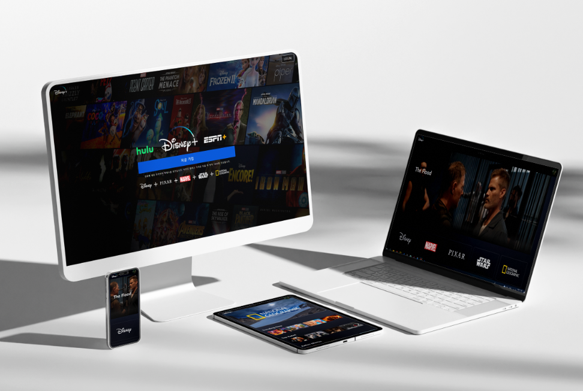

# React_DisneyPlus Clone

### 👉 [데모]()

## Mokup

 
 

### 🖐 프로젝트 목적

1. React 프레임워크 연습
2. https://www.themoviedb.org API 사용
3. ifame요소를 활용한 hyoutube.com 영상불러오기

### 📌 개발 언어

>  
> 
> 
> 

 

## 🖐 프로젝트 내에서 사용한 라이브러리

### 📁 1. Axios

> 브라우저, Node.js를 위한 Promise API를 활용하는 HTTP 비동기 통신 라이브러리로 밷엔드랑 프론트엔드랑 통신을 쉽게 하기 위해서 Ajax와 함께 사용한다. 현재 프로젝트에서는 많은량의 API호출이 진행되기때문에 axios 인스턴스를 생성하여 제작 진행

##### ※ axios 인스턴스란? HTTP 요청을 보낼 때 설정을 미리 지정한 객체

### 📁 2. Styled Component

> <a href="https://styled-components.com/docs/basics">StyledComponent 공홈링크</a>   CSS in JS라고 하는 Js파일 안에서 CSS를 처리 할 수 있도록해주는 대표적인 라이브러리이다.

##### ※ 설치방법 : 1 &#41; npm install styled-components --save 2 &#41; yarn add styled-components

##### ※ 사용방법 : const 사용할태그이름 = styled.생성할요소` 백틱내부에 스타일링작성진행`

### styled-components Code 예시&#41;

   
   

### 📁 3. react-router-DOM

<a href="https://reactrouter.com/en/main"> 🔗 React-Router-DOM 정리 Tistory </a>

> 웹 앱(React)에서 라우팅을 관리 및 구현하기 위한 라이브러이며, 라우팅이 실행 중인 앱 외부에 구성에서 처리되는 기존 라우팅 아키텍처와 달리 React Router DOM은 앱 및 플랫폼의 요구 사항에 따라 컴포넌트 기반 라우틍을 용이하게 한다.

---

 
 

### ☑️ Javascript 기본 내장함수 사용

1. Math.floor() : 주어진 숫자를 내림한 가장 가까운 정수를 반환
   > 예시 : Math.floor(3.7)은 3을 반환
2. Math.random() : 0 이상 1 미만의 난수(랜덤한 실수)를 반환

   > 예시 : 0.5480657455008418, 0.23934047397031555 등.. 0-1 사이의 난수를 랜덤으로 반환

   

3. substring() : 문자열에서 지정한 시작 위치부터 끝 위치 사이의 부분 문자열을 반환 한다.
   > 사용 구문 : string.substring(startIndex, endIndex)  
   > startIndex: 반환할 부분 문자열의 시작 위치를 나타내는 정수 값  
   > endIndex: 반환할 부분 문자열의 끝 위치를 나타내는 정수 값

 

### ☑️ HTML 새롭게 사용해본 요소

1. iframe
   > HTML Inline Frame 요소이며 Inline Frame의 약어이다  
   > 효과적으로 다른 HTML 페이지를 현재 페이지에 포함시키는 중첩된 브라우저로  
   > iframe요소를 이요하면 해당 웹 페이지 안에서 어떠한 제한 없이 다른 페이지를 불러와서 삽입 할 수 있다.
2. 엘리먼트 속성 'role'
   > 웹 요소가 어떤 역할을 수행하는지를 나타내는 역할(attribute)하며 이 속성은 웹 접근성을 개선하고, 스크린 리더나 보조 기술을 사용하는 사용자가 웹 사이트나 앱을 더 잘 이해할 수 있도록 도와줄 수 있다.  
   > 프로젝트 내 예시 코드 : `
`

   

### ☑️ CSS 새롭게 사용해본 속성 및 속성 값

1.  width : min-content
    > 해당 요소의 내용(content)을 최소한의 너비로 설정하도록 지정되는 속성값으로 내용의 길이에 따라 요소의 너비가 동적으로 결정되며, 내용이 얼마나 길든 해당 내용을 모두 수용할 수 있도록 요소의 크기가 조정한다.
2.  background-clip: 배경이 테두리, 안쪽 여백, 콘텐츠 상자 중 어디까지 차지할 지 지정
    > border-box : border, padding 부분까지 이미지가 보여짐 (기본값 )
    > padding-box : border 부분은 이미지가 보여지지 않음  
    > content-box : 여백(padding, border)을 제외한 content의 크기 만큼만 이미지가 보여지며 (현재 프로젝트에서 사용한 속성값)  
    > background-clip: text; / -webkit-background-clip: text; / color: transparent; 등등 있다  
    > <a href="https://developer.mozilla.org/ko/docs/Web/CSS/background-clip">※background-clipMDN공식문서 참고</a>
3.  align-items: unset;
    > align-items는 Flex, Grid를 사용할 때 요소들의 수직 정렬 방식을 지정할 때 사용하는 속성으로 unset값을 사용하면 이전에 다른 값을 가지고 있던 경우는 그 값을 따라가고 그렇지 않으면 기본 값으로 돌아게 된다.

 

### ☑️ javascript 프로젝트 진행 시 새롭게 알게된 내용

1. props로 전달할 때 전개연산자를 사용하여 객체데이터를 전달 할 경우 객체의 속성들이 각각 개별적인 props로 전달 되었기 때문에 객체명이 아닌 각 속성명을 props 받아야한다.
   

2. scrollLeft : Element가 가지고 있는 속성으로 요소의 콘텐츠가 왼쪽 가장자리에서 스크롤되는 픽셀수를 가져오거나 변경할 수 있음
   

3. WebAPI : URLSearchParams <a href="https://eunsoly.tistory.com/54"> 🔗추 가 정리 Tistory</a>
   

 

---

### ☑️ 참고내용

- Youtube 영상가져오기(이미지첨부 확인)

  

  
